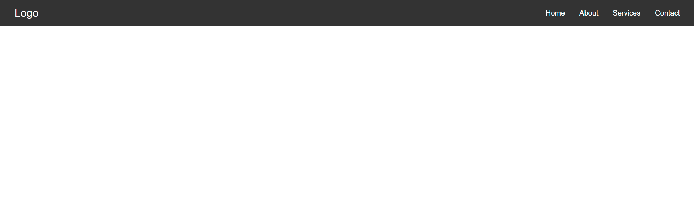

# Responsive Hamburger Menu

This project demonstrates a **responsive navigation bar** with a hamburger menu, built using HTML, CSS, and JavaScript.

## Features

- Responsive design: adapts to desktop and mobile screens
- Hamburger menu appears on smaller screens
- Smooth menu open/close animation
- Closes menu when a navigation link is clicked
- Simple, clean UI with hover effects

## How It Works

- On desktop, navigation links are displayed horizontally.
- On mobile (screen width ≤ 768px), links are hidden and replaced by a hamburger icon.
- Clicking the hamburger toggles the menu visibility and animates the icon.
- Clicking any navigation link closes the menu.

## Usage

1. Clone or download the repository.
2. Open `index.html` in your browser.
3. Edit `style.css` for custom styles.

## File Structure

/
├── index.html
├── style.css
 /
/
├── index.html
├── style.css
/

## Demo

.png)
.png)

---

**Built as part of the "100 Days of Mastering Frontend" challenge.**